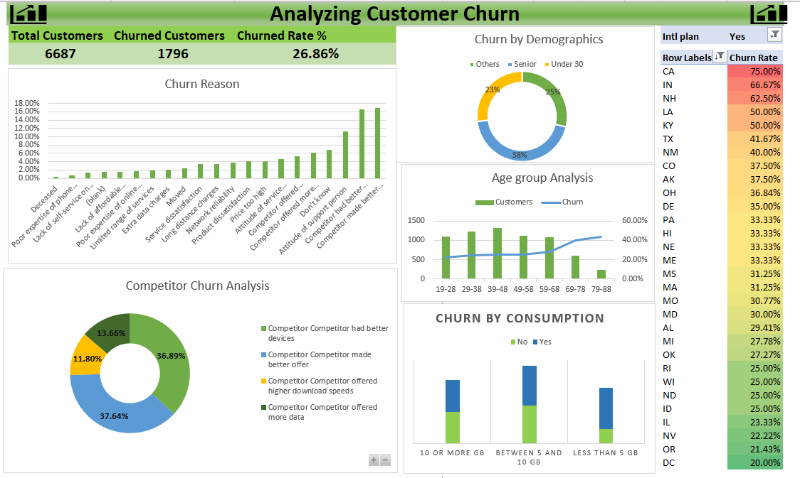

# 📉 Customer Churn Analysis — Excel

📊 **[Click here to interact with the live visualization](https://1drv.ms/x/c/99ebc07029dec733/EbBj7x3M7N9KiNNXrkfeCa0BoLqETRUiMMpxkNykY7bMBA?e=RJUWFP&nav=MTVfezQ5N0M1NEU4LTMyMjEtNDZFOC04NDM2LURDNTJFM0FCOTUwN30)**

## Overview
This project explores customer churn using Excel to identify patterns, drivers, and opportunities for retention. It features a clean, interactive dashboard built with PivotTables, PivotCharts, Slicers, and optional Power Query steps to automate data cleaning and refresh.

---

## Objectives
- **Business goal:** Reduce churn by understanding who leaves, when they leave, and why.
- **Key questions:**  
  - **Who churns?** By demographics, tenure, and usage.  
  - **When?** Seasonality and lifecycle stages.  
  - **Why?** Plan features, pricing, support interactions, or competitor pressure.  
  - **What to do?** Targeted retention actions by high‑risk segments.

---

## Dataset
- **Core fields:**  
  - **Customer profile:** CustomerID, Age, Segment, Region/State  
  - **Product/plan:** Plan type, Contract, Price  
  - **Engagement:** Monthly usage/consumption, Support contacts, Offers received  
  - **Outcome:** Churn flag, Churn reason, Churn date

---

## Tools and Excel Techniques
- **Excel features:** PivotTables, PivotCharts, Slicers, Timelines, Conditional Formatting.
- **Data cleaning:** Power Query (remove duplicates, data types, null handling), Text-to-Columns.
- **Modeling helpers:** Named ranges, Dynamic arrays (FILTER, UNIQUE, SORT), XLOOKUP.
- **Metrics:** Calculated fields/measures for churn rate, retention rate, and segment-level KPIs.

---

## Methodology
1. **Data ingestion and cleaning**  
   - **Power Query steps:** trim/clean text, standardize categories, convert dates, deduplicate by CustomerID.  
   - **Validation:** completeness checks, outlier scan on usage and tenure.
2. **Feature engineering**  
   - **Derived fields:** Tenure buckets, Age groups, Usage tiers, Price bands.  
   - **Churn reason grouping:** Competitor vs. service vs. pricing vs. support.
3. **Analysis layers**  
   - **Descriptives:** Overall churn rate, monthly trend, cohort churn.  
   - **Segmentation:** By region/state, plan, age group, usage tiers.  
   - **Drivers view:** Cross-tab churn vs. churn reason, support interactions, discounts.
4. **Dashboard build**  
   - **Design:** KPI cards, trend lines, stacked bars for reasons, heatmap by region/state, funnel by lifecycle stage.  
   - **Interactivity:** Global Slicers for date, region, plan, and segment; drill-through via PivotTable filters.
   

---

## Metrics and KPIs
- **Churn rate**
  
- **Voluntary vs. involuntary churn:** Split by reason codes.  
- **Segment churn:** By region, plan, age group, tenure, and usage tier.  
- **Competitor impact:** Share of churn attributed to competitor offers/devices/speeds.  
- **Support-related churn:** Churn linked to ticket volume, wait times, or dissatisfaction.
---

## Attribution and Contact
- **Author:** Augustine Nwenewor 
- **Connect:** [LinkedIn](https://www.linkedin.com/in/augustine-nwenewor/), [Email](mailto:nwenewoaugustine22@gmail.com) 
- **License:** [MIT] 
